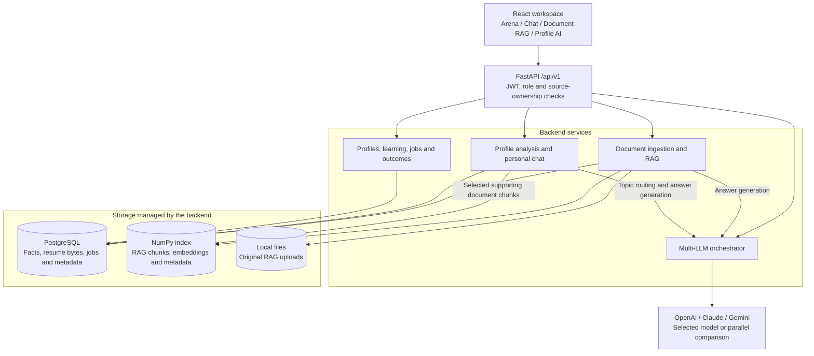
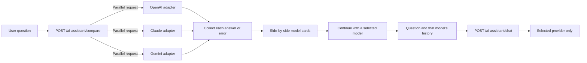
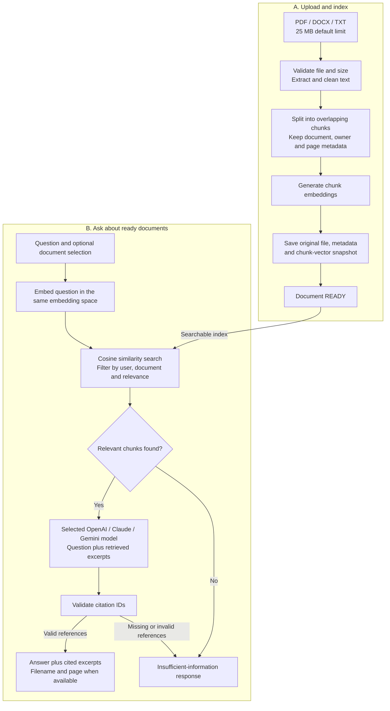
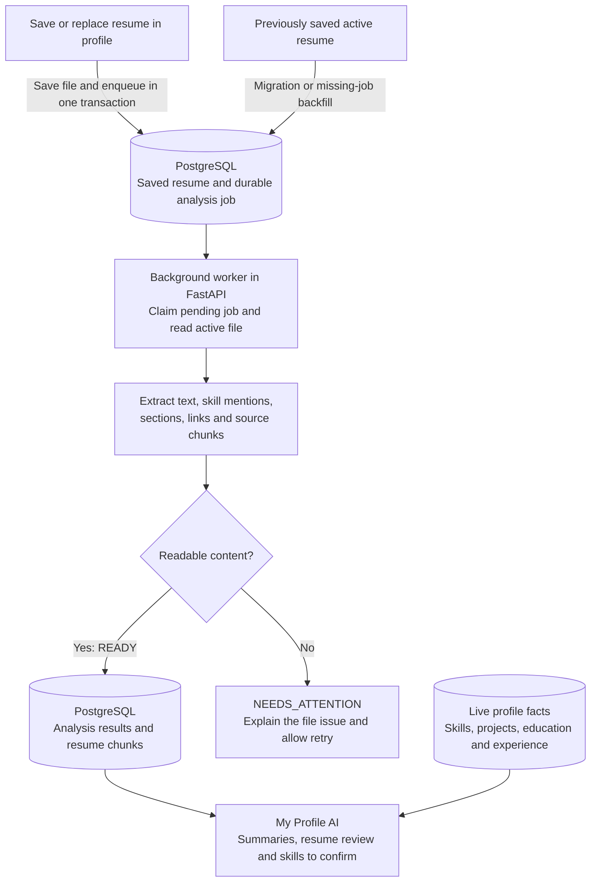

# 🎓 SkillBridge AI — Academia-to-Industry Employability Platform

> An enterprise-grade employability ecosystem bridging higher education and industry hiring through role-based learning tracks, employment outcome analytics, **Multi-LLM Arena intelligence**, and **Grounded Document RAG** with verifiable citations.

[](https://fastapi.tiangolo.com)
[](https://react.dev)
[](https://www.typescriptlang.org/)
[](https://python.org)
[](https://www.postgresql.org/)
[](https://tailwindcss.com/)
[](https://opensource.org/licenses/MIT)

---

## Verification and upgrade notes

The canonical application is in `backend/` and `frontend/`; the root `app/` is
legacy code. Run backend commands **from `backend/`** to load the correct package.
See [the audit report](docs/AI_ASSISTANT_AUDIT.md) for fixes, tests, and remaining limitations.

- Run `python -m alembic upgrade head` from `backend/` to create the RAG metadata and automatic resume analysis tables (head: `0013_profile_resume_analysis`).
- **My Profile AI** connects your saved resume, skills, projects and documents, with source-backed chat and explainable job coverage. See [setup, behavior and verification](docs/PROFILE_AI.md).
- All AI routes require a valid login. Documents are private to their uploading user; legacy unowned documents are not public.
- New vector snapshots include the embedding model identity. Legacy indexes without that identity, or indexes made with another model, require deliberate re-indexing into a new vector directory. Keep original documents and a backup; do not delete the old index automatically.
- Local vector storage supports one backend worker. No-key embeddings are a deterministic test/demo mode, not semantic production embeddings.
- Chat history is separate per model during the current page session; it is not saved across reloads.

## 📌 Executive Summary

**SkillBridge AI** is an intelligent employability and skills acceleration platform built for students, academic institutions, mentors, and corporate recruiters. It unifies academic curricula with real-world industry demands, tracking student competencies, automated portfolio readiness, internship lifecycles, and employment outcomes.

Powered by a modern **Enterprise Multi-LLM & RAG Assistant**, SkillBridge empowers users to query internal placement documents, compare competitive reasoning across **OpenAI GPT-4o**, **Anthropic Claude 3.5 Sonnet**, and **Google Gemini 1.5/2.5/3 Flash** simultaneously, and ingest corporate handbooks with strict **document grounding and citation validation** and **clickable citations**.

---

## 🏗️ Architecture & Data Flow

The application runs from **`frontend/` (React + Vite)** and **`backend/` (FastAPI)**.
The AI workspace has four tabs, with different sources and responsibilities:

| Workspace tab | Input and sources | Result |
|---|---|---|
| **Multi-LLM Arena** | A question sent to three provider adapters in parallel | Side-by-side answers, response times and individual provider errors |
| **Continuous Chat** | A question and the selected model's conversation history | A conversation with one model; history is separate per model in the browser |
| **Document RAG & Citations** | Uploaded PDF/DOCX/TXT files, searched using embeddings | An answer from retrieved document excerpts, with clickable source references |
| **My Profile AI** | The student's saved profile, active resume, selected supporting documents and optional target job | Skills, summaries, resume feedback, job coverage, cited personal answers and labeled skill learning |

Arena and Continuous Chat do not automatically receive profile or document data.
**My Profile AI automatically reads the resume file already saved in the app's profile.**
The student does not need to upload that same resume again in Document RAG.

### System overview

The browser calls the backend; the backend checks access, reads the appropriate
sources and calls external providers when generation is needed. Responses return
through the API to the selected workspace tab. The arrows below show backend
requests and data access.



OpenRouter belongs to the **separate platform recommendation fallback service**.
It is not a fourth provider in the Arena, Document RAG or Profile AI comparison.
Provider model names are configured on the backend.

### 1. Multi-LLM comparison and continued chat



The backend uses `asyncio.gather` for comparison. A failed or unconfigured provider
returns its own error without discarding the other providers' answers. Continuous
Chat keeps each model's history in the current browser page session; it is not
persisted across reloads.

### 2. Document RAG: upload first, then retrieve and answer

**Ingestion** prepares a document for search. **Retrieval** selects relevant excerpts
when the user asks a question. An embedding is a numeric representation used to
compare the question with document chunks.



- Upload route: `POST /api/v1/ai-assistant/documents/upload`. Ingestion completes
  within this request; the document becomes ready after it is saved successfully.
- Question route: `POST /api/v1/ai-assistant/rag/query`. The answer model is selected
  by the user and is independent of the embedding provider.
- Embeddings use OpenAI when configured, otherwise Gemini when configured. With
  neither configured, deterministic hash vectors support offline demos/tests.
  Provider failures do not silently switch an existing embedding space.
- Citations link to retrieved excerpts. PDF page numbers are preserved when
  available; DOCX/TXT do not receive invented page numbers. Valid citation IDs
  alone do not prove that every generated claim is supported.

### 3. Profile AI: automatic saved-resume analysis

Here, **auto-fetch means reading the active resume bytes stored in this app's
database**. It does not mean downloading a resume from an arbitrary external URL.



The worker runs with the backend by default. Durable jobs survive restarts;
expired processing leases can be retried. The UI polls while analysis is pending.
A replaced or deleted resume is no longer eligible for new answers, and a worker
processing an old upload cannot publish it as the current resume.

After extraction, the following paths use the saved evidence:

| Path | Data flow |
|---|---|
| **Profile facts and summaries** | Live profile tables + extracted resume facts → skills/project lists, three-line summaries and text-based quality checks. No LLM key is required. |
| **Subject and learning links** | Recorded skills, resume mentions, project technologies and field of study → matching public/active-organization catalogue links. Ready study documents can open a cited conversation directly from the overview. |
| **Personal chat** | Check source ownership and version → retrieve selected facts/chunks → route the question → selected LLM, or all three with the same context → citation and quotation checks → answer. |
| **Skill learning** | Profile/project question → route against recorded topics → selected LLM, or all three with the same topic context → validate learning output → labeled general knowledge without resume citations. |
| **Question guidance** | Unclear or unrecorded learning topic → clarification. Unrelated request → brief redirect. Every new question is evaluated; conversation history does not authorize unrelated subjects. |
| **Job matching** | Open job posting or pasted JD → explicit/detected target skills → separate checks against resume text and profile records → keyword coverage, catalog learning links and suggested practice projects. |

In **Profile, resume & learning** mode, "Who created Python?" can receive a general
learning answer if Python is recorded; the same applies to Java or any other
recorded topic. Such answers are labeled **Skill learning** and are not attributed
to the resume. A later unrelated question is checked independently.

The router uses saved skills, recognized resume skills, department and project
technologies. Selected-project mode uses that project's technologies. It judges
the requested task rather than using a food/sports keyword blacklist. Ambiguous
wording needs one model classification before generation; topic IDs are validated,
and a failed classification returns a retryable error. Model classification can
make mistakes. **Resume only**, **My documents** and **Target job & my evidence**
remain source-based modes. See [question handling](docs/PROFILE_AI.md#how-questions-are-handled).

**Profile AI and Document RAG share supporting documents, but use different
retrieval paths.** Profile AI uses bounded keyword retrieval over saved resume
chunks and selected uploaded-document chunks. Document RAG uses embedding-based
cosine search. A saved resume is not automatically copied into the RAG vector index.

For example, upload `architecture.pdf` in **Document RAG**, then choose
**My Profile AI → Sources → Selected project → Supporting document** to discuss
that file alongside the project's saved details. Subject notes can also be
selected as documents; the app does not automatically discover or associate them.

Profile skills, resume mentions, job requirements and AI suggestions remain
distinct. Accepting a suggested skill is an explicit user action. Job coverage
does not treat a profile-only skill as evidence in the submitted resume, and is
not a vendor ATS score or hiring prediction. Profile chat history clears when
the model, scope or source version changes.

### Storage and code map

| Data | Storage | Main implementation |
|---|---|---|
| Profile, skills, projects and experience | PostgreSQL student tables | `backend/app/services/profile_context.py` |
| Original saved resume | PostgreSQL `student_documents.file_data`; active flag selects the current version | `backend/app/api/v1/router.py` |
| Resume processing jobs, results and text chunks | PostgreSQL `profile_resume_analyses` | `backend/app/services/profile_worker.py` and `profile_extraction.py` |
| RAG document ownership, filename and file location | PostgreSQL `rag_documents` | `backend/app/api/v1/endpoints/ai_assistant.py` |
| Original RAG uploads | Files under `RAG_STORAGE_DIR` | `backend/app/api/v1/endpoints/ai_assistant.py` |
| RAG chunks, vectors and embedding identity | In-memory NumPy store, persisted to `RAG_VECTORS_DIR/index.npz` | `backend/app/rag/vector_store.py` |
| Personal retrieval, question routing, chat and job coverage | Computed from current sources; source versions detect stale answers | `backend/app/services/profile_chat.py`, `profile_routing.py` and `profile_matching.py` |
| Browser views and conversation state | React page memory | `frontend/src/pages/ai/AIAssistantPage.tsx` and `frontend/src/components/ai/ProfileAI.tsx` |

The local RAG index supports **one backend worker**. Saved project/GitHub links
are references; their remote contents are not fetched. Scanned-resume OCR and
old binary DOC conversion are not implemented. See [Profile AI setup and
limitations](docs/PROFILE_AI.md) for processing states, API contracts and examples.

---

## 🚀 Key Modules & Completed Phases

### 1. Phase 8: Robust Backend Foundation
- **FastAPI Core**: Modular architecture with versioned routing (`/api/v1`).
- **PostgreSQL 16 & SQLAlchemy 2.x**: Relational schema modeling with Alembic migration history.
- **Authentication & RBAC**: Stateless JWT bearer tokens, bcrypt password hashing, and role hierarchies (`STUDENT`, `ADMIN`, `INDUSTRY_ADMIN`, `FACULTY`, `MENTOR`, `RECRUITER`).
- **Standardized Response Envelope**: Uniform `{ success, data, error }` contract.

### 2. Phase 9: Student Portfolio & Lifecycle
- Comprehensive profile completeness scoring and real-time skill proficiency tracking.
- Project showcases, certifications, achievements, and internship experience logs.
- Direct-to-database resume storage (`BYTEA`/`LargeBinary`) preserving security and data isolation.

### 3. Phase 21: Employment Outcome Tracking
- Auditable tracking of employment transitions: company, job title, salary/CTC, offer letters, joining dates, and employment types.
- RESTful CRUD with student ownership verification.

### 4. Phase 22 & 23: Resilient AI Recommendation Engine
- Dual-tier failover: `Gemini Primary -> OpenRouter Fallback -> Deterministic Rule-Based Fallback`.
- Telemetry log table (`ai_executions`) storing latency, token counts, error codes, and outputs.
- Normalized career, learning path, and internship recommendations.

### 5. Phase 24: Enterprise Multi-LLM + Grounded RAG Assistant
- 🥊 **Multi-LLM Arena**:
  - Concurrent side-by-side prompt dispatch across **OpenAI (gpt-4o)**, **Anthropic Claude (claude-3-5-sonnet)**, and **Google Gemini (gemini-3-flash-preview)** via `asyncio.gather`.
  - Live latency benchmarking, token metrics, and visual comparison grids.
- 💬 **Continuous Multi-Turn AI Chat**:
  - Conversational context-aware workspace with seamless model switching and clear chat history management.
- 📚 **Grounded Document RAG with Verifiable Citations**:
  - Multi-format ingestion: **PDF**, **DOCX**, and **TXT** files (up to 25MB).
  - Semantic recursive chunker with overlap and page-number preservation.
  - **Adaptive Thresholding Retrieval**: Dynamic cosine similarity scoring (0.48/0.45 fallback) for broad document queries when no explicit threshold is supplied. Top-K retrieval does not guarantee complete document coverage.
  - **Grounded Answer Validation**: Deterministic refusal (*"I could not find sufficient information in the uploaded documents to answer this question."*) when relevant context is absent.
  - **Clickable Interactive Citations**: Footnote badges `[1]`, `[2]` linking directly to document names, page indices, and verbatim snippet previews.
- 🎨 **Custom In-App Animated Delete Modal**:
  - Replaced browser `window.confirm()` with an animated dialog.
  - Features dark backdrop blur (`backdrop-blur-xs`), smooth entrance zoom animation (`zoom-in-95 duration-200`), file metadata badge, permanent vector purge alert, and responsive delete/cancel controls.

---

## 🛠️ Technology Stack

| Layer | Technologies |
|---|---|
| **Frontend** | React 18, Vite 6, TypeScript, Tailwind CSS, Lucide Icons, Axios |
| **Backend** | Python 3.11+, FastAPI, Pydantic v2, Pydantic Settings |
| **Database & ORM** | PostgreSQL 16, SQLAlchemy 2.x, Alembic, psycopg |
| **Authentication** | JWT (python-jose), Passlib (bcrypt) |
| **Vector Engine & RAG** | NumPy Cosine Similarity, PyPDF, python-docx, In-Memory/Disk Vector Persistence |
| **LLM Integrations** | Google Gemini API, OpenAI API, Anthropic Claude API, OpenRouter |
| **Testing & Verification** | Pytest, HTTPX, Playwright MCP End-to-End Automation |

---

## ⚡ Quick Start Guide

### Prerequisites
- **Node.js**: `v22.12` or higher (required by the current Vite toolchain)
- **Python**: `3.11` or higher
- **PostgreSQL**: `v16` running locally or accessible remotely

---

### 1. Backend Setup

1. **Clone the repository**:
   ```bash
   git clone https://github.com/Babar-5566/SIH26044---Assess-Upskill-Connect-Get-Hired-Grow.git
   cd SIH26044---Assess-Upskill-Connect-Get-Hired-Grow/backend
   ```

2. **Create and activate virtual environment**:
   ```powershell
   # Windows (PowerShell)
   python -m venv .venv
   .venv\Scripts\Activate.ps1

   # Linux / macOS
   python3 -m venv .venv
   source .venv/bin/activate
   ```

3. **Install dependencies**:
   ```bash
   pip install --upgrade pip
   pip install -r requirements.txt
   ```

4. **Configure Environment Variables**:
   Copy `.env.example` to `.env`:
   ```powershell
   Copy-Item .env.example .env
   ```

   Configure the database URL and a randomly generated `SECRET_KEY` in `backend/.env`.
   Provider key placeholders are in [backend/.env.example](backend/.env.example).
   The backend accepts `GOOGLE_API_KEY` (or legacy `GEMINI_API_KEY`) and
   `ANTHROPIC_API_KEY` (or legacy `CLAUDE_API_KEY`). Keep all keys server-side.
   Choose models available to your provider account; configuration does not verify access.

5. **Run Migrations & Seed Data**:
   ```bash
   alembic upgrade head
   python -m app.scripts.seed
   ```

6. **Start Backend Server**:
   ```bash
   python -m uvicorn app.main:app --reload --host 127.0.0.1 --port 8000
   ```
   - API Docs (Swagger): `http://127.0.0.1:8000/docs`
   - ReDoc: `http://127.0.0.1:8000/redoc`

---

### 2. Frontend Setup

1. **Navigate to the frontend directory**:
   ```bash
   cd ../frontend
   ```

2. **Install dependencies**:
   ```bash
   npm install
   ```

3. **Start Development Server**:
   ```bash
   npm run dev
   ```
   - App URL: `http://localhost:5173`

---

## 👥 Demo Credentials

| Role | Email | Password | Permissions |
|---|---|---|---|
| **Student** | `student.test@gmail.com` | `student@123` | Profile, RAG Assistant, Skills, Applications, Outcomes |
| **Admin** | `admin.test@example.com` | `admin@123` | Full administrative oversight and user management |
| **Recruiter** | `recruiter.test@example.com` | `recruiter@123` | Job/Internship postings, candidate search |
| **Faculty** | `faculty.test@example.com` | `faculty@123` | Academic performance reviews, curriculum tracks |
| **Mentor** | `mentor.test@example.com` | `mentor@123` | 1-on-1 student mentorship, mock interviews |
| **Industry Admin** | `industry.admin.test@example.com` | `industry@123` | Corporate partnership and placement analytics |

---

## 📡 API Endpoints Reference

### Authentication (`/api/v1/auth`)
- `POST /register` — Register a new student or corporate account
- `POST /login` — Authenticate and receive a signed JWT bearer token
- `GET /me` — Fetch current user context and permissions

### Student Lifecycle & Outcomes (`/api/v1/students`)
- `GET /me` — Full student profile with completeness calculation
- `GET /me/skills` | `POST /me/skills` — Manage technical & professional skills
- `GET /me/resume` | `POST /me/resume` — Secure binary resume upload & download
- `GET /me/outcomes` | `POST /me/outcomes` — Track salary, offers, and placement data

### Multi-LLM & Grounded RAG Assistant (`/api/v1/ai-assistant`)
| Method | Endpoint | Description |
|---|---|---|
| `GET` | `/models` | List active foundation models (Gemini, Claude, GPT-4o) with status |
| `POST` | `/compare` | Dispatches identical prompt concurrently across all configured LLMs |
| `POST` | `/chat` | Conversational chat with client-supplied per-model history |
| `POST` | `/documents/upload` | Ingests PDF/DOCX/TXT, extracts text, generates vector chunks & index |
| `GET` | `/documents` | Lists all indexed vector documents and chunk counts for current user |
| `DELETE` | `/documents/{id}` | Purges document from disk and removes all vectors from index |
| `POST` | `/rag/query` | Adaptive vector search + Grounded synthesis with citations `[1]`, `[2]` |

---

## 🧪 Testing & Quality Verification

### Automated Backend Tests
Run the comprehensive pytest suite:
```bash
cd backend
python -m pytest -q
```

**Test Coverage Highlights**:
- `test_ai_assistant_api.py`: Upload, query lifecycle, fallback handling, delete cascade.
- `test_rag_engine.py`: Scoped retrieval, adaptive thresholding, anti-hallucination refusal.
- `test_vector_store.py`: Vector normalization, cosine similarity top-K ranking, persistence.
- `test_rag_ingestion.py`: PyPDF, python-docx, plain TXT chunking with overlap guarantees.
- `test_multi_llm_adapters.py`: Independent adapter response formatting and error handling.
- `test_security_audit.py`: Role boundaries, unauthorized token rejections.

```text
182 passed (offline tests; provider calls mocked or disabled)
```

### Automated End-to-End Verification
Visual workflows and UI states are verified using **Playwright MCP**:
- In-App animated delete confirmation modal verified with zero native browser alerts.
- Clickable citation cards open snippet inspector modals with metadata.
- Scoped document queries preserve the requested relevance threshold and validate citation references.

---

## 🔒 Security & Privacy

- **Server-Side AI Secrets**: API keys for OpenAI, Anthropic, and Google Gemini are never leaked to client bundles or browser localStorage.
- **Tenant Document Isolation**: Document ingestion and RAG vector searches are partitioned per authenticated user; cross-tenant document exposure is rejected at the vector query filter.
- **Grounding limits**: Missing context and missing/invalid citation IDs produce the documented refusal. Valid citation IDs do not prove that every generated claim is supported; verify important answers against the full source chunks.
- **Cryptographic Security**: Passwords hashed using bcrypt; JWT tokens validated with expiration boundaries and subject checks.

---

## 📄 License

This project is licensed under the **MIT License**.

- Full license text: [LICENSE](LICENSE)
- You are free to use, modify, distribute, and integrate this software into commercial or academic projects, provided the original copyright notice and warranty disclaimer are preserved.

